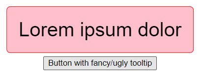

# v-tooltip

## Vue 3 tooltip custom directive

**Table of contents**

-   [Installation](#installation)
-   [Usage](#usage)
    -   [String notation](#string-notation)
    -   [Object notation](#object-notation)
    -   [Customizing tooltips globally](#customizing-tooltips-globally)
-   [API reference](#api-reference)

### Installation

Paste `tooltip.js` in your `src` folder, I personally create folder `directives` inside for the sake of clarity. Next step is to paste `tooltip.css` inside your `assets` folder.

When you have all the files, open your `main.js` file (or whatever it is called, the one where you mount your app) and import those files. Then use `app.directive` to globally add `v-tooltip` custom directive. It should look similar to that:

```js
import { createApp } from "vue";
import App from "./App.vue";
import tooltip from "./directives/tooltip.js";
import "@/assets/tooltip.css";

const app = createApp(App);
// app.directive's first argument is the directive's name you will use
// it can be whatever you wish
app.directive("tooltip", tooltip);
app.mount("#app");
```

And that's it! Now you can use it everywhere (there are some limitations though, f.e. it doesn't work for `<select>` element, you have add `v-tooltip` to its wrapper).

### Usage

Using `v-tooltip` is really simple. Just like any other directive you add it to the element and provide some data. The easiest example look like this:

```html
<template>
    <button v-tooltip="'This button deletes our universe'">
        Delete universe
    </button>
</template>
```

You just provide a string to the `v-tooltip` and it does its magic to create your own reactive tooltip. On hover it will look like that:


#### String notation

V-tooltip accepts both strings as well as objects. If you don't need any local customization, strings are the way to go. V-tooltip updates automatically, so you can have live changing tooltip.

```js
<template>
    <button
    v-tooltip="`You did nothing ${count} times`"
    @click="increaseCount"
    >
        Do nothing
    </button>
</template>

<script>
export default {
    data() {
        return {
            count: 0
        };
    },
    methods: {
        increaseCount() {
            this.count++;
        }
    }
}
</script>
```

Result after clicking 4 times:


#### Object notation

Object notation gives many more possibilities. If you want to have tooltips which differ from each other, this can be easily done (you would probably use `computed` property to declutter template):

```html
<template>
    <button
        v-tooltip="{
                    text: 'Lorem ipsum dolor',
                    theme: {
                        color: '#000000',
                        border: '1px solid red',
                        'background-color': 'pink',
                        'font-size': '2rem',
                    },
                }"
    >
        Button with fancy/ugly tooltip
    </button>
</template>
```



**Worth noting**: `text` property is optional, so you can do some tricky stuff, like adding only v-tooltip `theme` to some `<div>` and every tooltip inside that `<div>` will inherit that theme instead of the default one.

#### Customizing tooltips globally

It's more likely that you want to have all tooltips look the same, but different than the default. You have two options:

1. edit `tooltip.css` file
2. use object notations with `global` property

##### Option 1

At the top of `tooltip.css` there are a bunch of CSS variables which define all of the customizable properties of `v-tooltip`. Just change them and that will work globally as a default.

##### Option 2

You can also don't touch the `tooltip.css` and do the same thing using `v-tooltip` with property `global: true`:

```html
<template>
    <div
        v-tooltip="{
                    global: true,
                    theme: {
                        placement: 'bottom',
                        width: 'fit-content',
                        padding: '2rem',
                    },
                }"
    >
        <button v-tooltip="'tooltip with changed default style'">
            I run out of ideas
        </button>
    </div>
</template>
```

This will affect every tooltip in the app, because it changes the CSS variables in the `:root`. You can place it wherever you want, I suggest adding it to the top element in the app, using it as semi-"layout" component.


### API reference

#### v-tooltip

-   Expects: `string | Object`
-   Options (all of them are non-mandatory):
    -   text - text inside created tooltip
    -   theme - takes care of styling tooltips of the element and its children. Accepted properties:
        -   placement - `top (default), bottom, left, right`: placement of the tooltip relative to the element its called on
        -   offset - `[]` `top, bottom, left, right`: automatically calculate and re-positions the tooltip to prevent overflow from mentioned sides. Will be ignored if `global` is set.
        -   width - default `max-content`
        -   background-color - default `#000000`
        -   color - default `#ffffff`
        -   border-radius - default `0.4rem`
        -   padding - default `0.6em`
        -   font-size - default `0.8rem`
        -   border - default `none`
        -   transition-duration - default `0.25s`
        -   transition-delay - default `0.3s`
        -   transition-timing-function - default `ease`
    -   global - when added, tooltip won't be shown on this element. Instead it modifies CSS variables in the `:root`, therefore changing theme for all of the tooltips on the page
